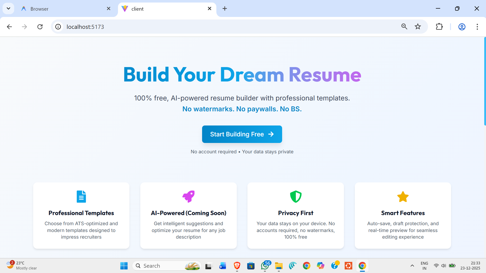
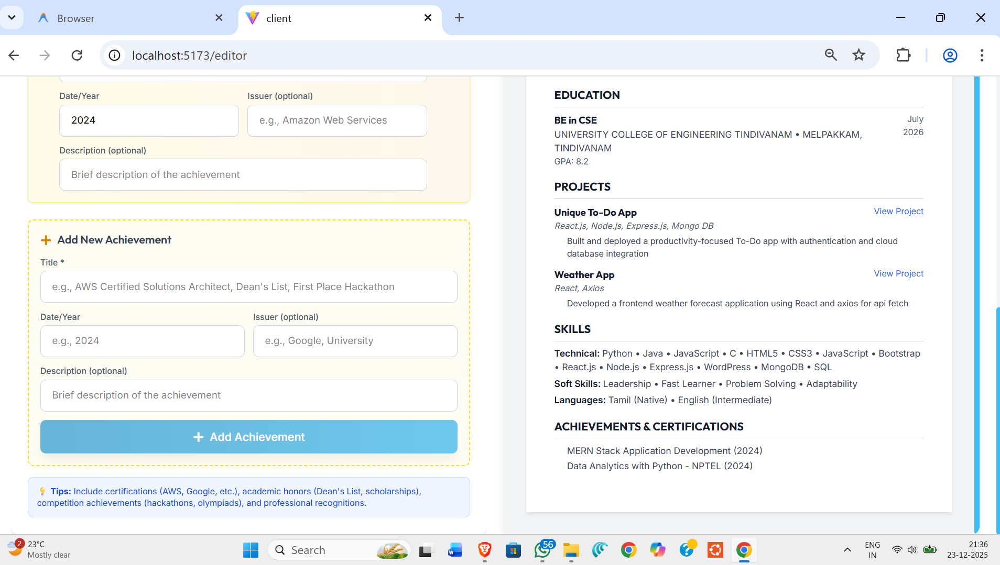
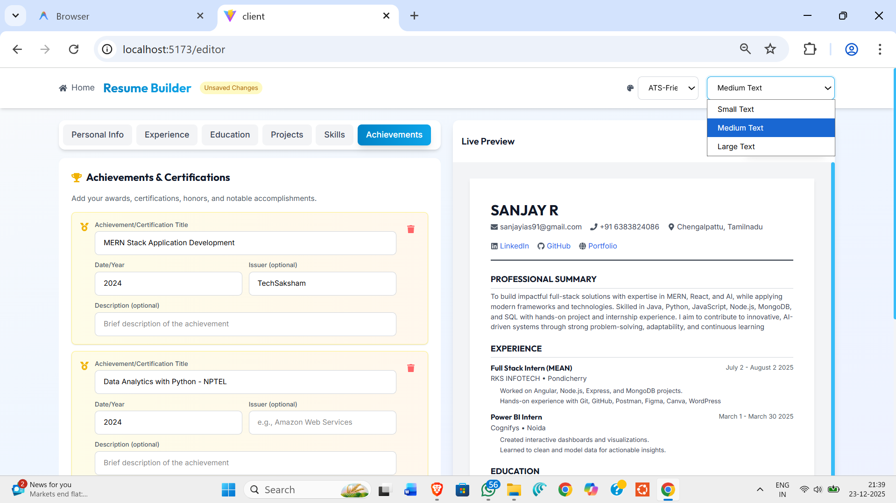
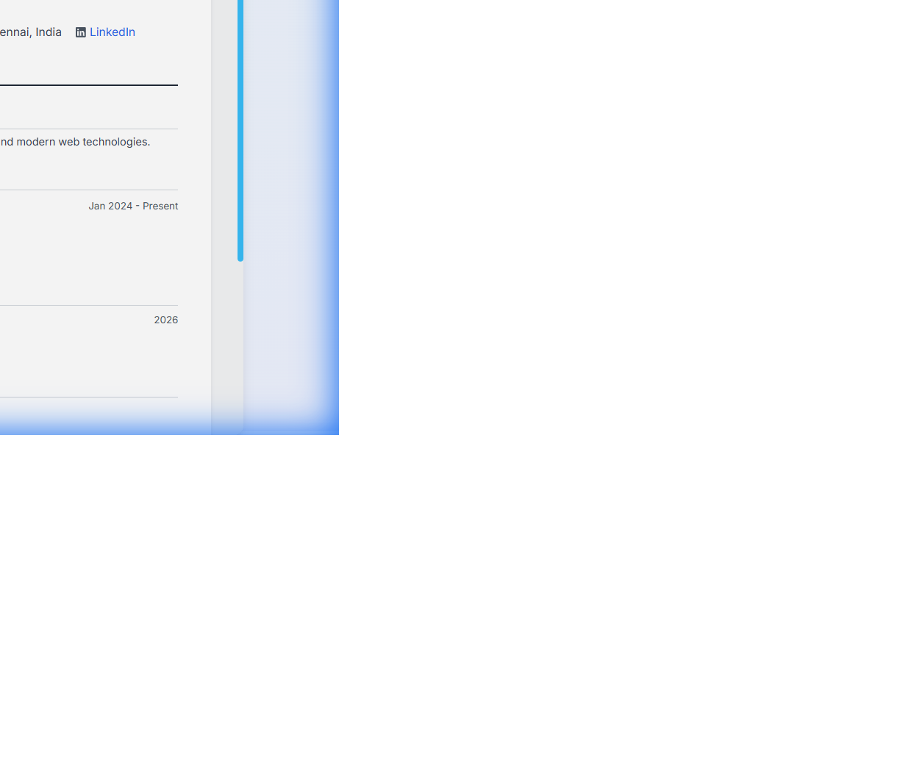
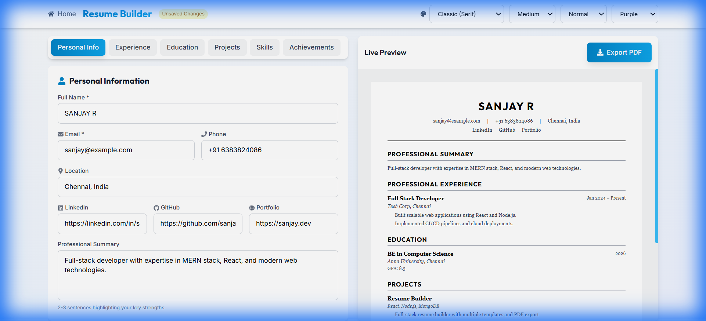
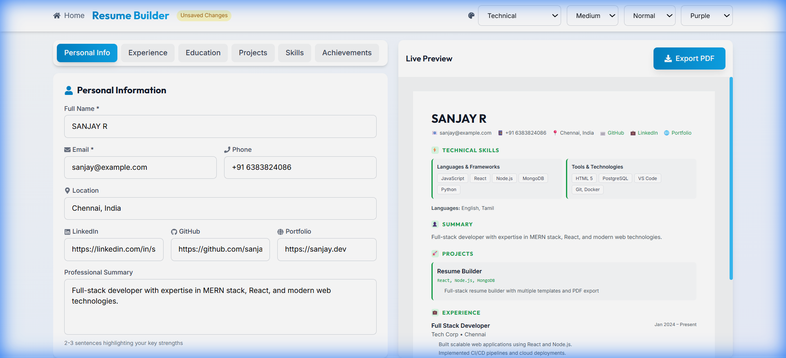

<div align="center">

# 📄 Resume Builder Pro

### Build Professional, ATS-Friendly Resumes in Minutes


[✨ Features](#-features) • [🖼️ Screenshots](#️-screenshots) • [🚀 Quick Start](#-quick-start) • [📂 Project Structure](#-project-structure) • [🎨 Templates](#-available-templates)

</div>

---

## 🎯 The Problem

Creating a professional resume is challenging:
- **Generic templates** don't stand out
- **Complex formatting** breaks during PDF export
- **Paid tools** charge for basic features
- **ATS systems** reject poorly formatted resumes
- **No real-time preview** makes editing frustrating

## 💡 The Solution

**Resume Builder Pro** is a free, open-source resume builder that solves all these problems:

✅ **18 Professional Templates** - From ATS-friendly to modern sidebar layouts  
✅ **Real-Time Preview** - See changes instantly as you type  
✅ **Perfect PDF Export** - Print-optimized with proper page breaks  
✅ **100% ATS Compatible** - Standard fonts, clean structure, no fancy graphics  
✅ **Auto-Save** - Never lose your progress with localStorage persistence  
✅ **Smart Skills Categorization** - Auto-organizes skills by type (Languages, Frameworks, Databases, Tools)  

---

## ✨ Features

<table>
<tr>
<td width="50%">

### 🎨 Template Variety
- **18 unique templates** organized by category
- Single-column, two-column, and sidebar layouts
- Professional fonts from Google Fonts
- Color scheme options (Blue, Purple, Green)

</td>
<td width="50%">

### ⚡ Real-Time Editing
- **Live preview** updates instantly
- Tab-based section navigation
- Drag-and-drop section reordering
- "Unsaved Changes" indicator

</td>
</tr>
<tr>
<td width="50%">

### 📄 PDF Export
- **Browser-native print** for perfect quality
- Proper page break handling
- Preserves colors, fonts, and layouts
- A4 size optimization

</td>
<td width="50%">

### 🔧 Customization
- Font size options (Small, Medium, Large)
- Line spacing control (Compact, Normal, Relaxed)
- Color scheme selection
- Section order customization

</td>
</tr>
</table>

---

## 🖼️ Screenshots

### 🏠 Homepage
A modern, gradient-styled landing page with call-to-action buttons.



---

### ✏️ Resume Editor - Personal Information
Clean form interface for entering personal details with live preview on the right.


---

### 💼 Resume Editor - Experience Section
Add work experience with company, role, dates, and bullet points.


---

### 🎓 Resume Editor - Education Section
Add educational background with degree, institution, GPA, and graduation date.


---

### 🚀 Resume Editor - Projects Section
Showcase your projects with descriptions, technologies, and links.


---

### 🛠️ Resume Editor - Skills Section
Add technical skills, soft skills, and languages with tag-based input.


---

### 🏆 Resume Editor - Achievements Section
Add certifications, awards, and achievements.



---

### 📊 Template - Sidebar Layout
Professional split-layout with dark sidebar for skills and main area for experience.



---

### 🎨 Template - Modern Style
Contemporary design with gradient header and clean typography.


---

### 📄 PDF Export Preview
Print-ready PDF export with proper formatting and page breaks.


---

### 🎯 Template Selector
Dropdown with 18 templates organized by category for easy selection.


---

## 🎨 Template Showcase Gallery

### 📋 18 Templates Available
All templates organized by category in a clean dropdown interface.


---

### Template Previews (One from Each Category)

<table>
<tr>
<td align="center" width="50%">
<strong>📋 ATS Friendly (Standard)</strong><br>
Clean, parser-optimized for any job
<br><br>

</td>
<td align="center" width="50%">
<strong>📜 Classic (Traditional)</strong><br>
Timeless serif fonts design
<br><br>

</td>
</tr>
<tr>
<td align="center" width="50%">
<strong>💼 Executive (Professional)</strong><br>
Bold navy for senior roles
<br><br>

</td>
<td align="center" width="50%">
<strong>🎯 Minimal (Modern)</strong><br>
Maximum whitespace, clean look
<br><br>

</td>
</tr>
<tr>
<td align="center" width="50%">
<strong>🔧 Technical (Specialized)</strong><br>
Skills-first for developers
<br><br>

</td>
<td align="center" width="50%">
<strong>📊 Two Column (Sidebar)</strong><br>
Split layout for dense content
<br><br>

</td>
</tr>
</table>

---

## 🏗️ Architecture

```
┌─────────────────────────────────────────────────────────────────┐
│                        Resume Builder Pro                        │
├─────────────────────────────────────────────────────────────────┤
│                                                                  │
│  ┌──────────────┐    ┌──────────────┐    ┌──────────────┐       │
│  │   React 19   │ => │   Zustand    │ => │   Templates  │       │
│  │  Components  │    │    Store     │    │   (18 JSX)   │       │
│  └──────────────┘    └──────────────┘    └──────────────┘       │
│         │                   │                   │                │
│         v                   v                   v                │
│  ┌──────────────┐    ┌──────────────┐    ┌──────────────┐       │
│  │  Editor UI   │    │ localStorage │    │  PDF Export  │       │
│  │   (Forms)    │    │ (Persist)    │    │ (Print API)  │       │
│  └──────────────┘    └──────────────┘    └──────────────┘       │
│                                                                  │
└─────────────────────────────────────────────────────────────────┘
```

### Tech Stack

| Layer | Technology | Purpose |
|-------|------------|---------|
| **UI Framework** | React 19 | Component-based UI |
| **Build Tool** | Vite 7.3 | Fast HMR & bundling |
| **Styling** | Tailwind CSS 4 | Utility-first CSS |
| **State** | Zustand 5 | Global state management |
| **Routing** | React Router 7 | Client-side navigation |
| **Icons** | React Icons | Icon library |
| **Storage** | localStorage | Data persistence |

---

## 📂 Project Structure

```
resume-builder-pro/
├── 📁 public/               # Static assets
├── 📁 screenshots/          # README screenshots
├── 📁 src/
│   ├── 📁 components/
│   │   ├── 📁 editor/       # Form components
│   │   │   ├── PersonalInfoForm.jsx
│   │   │   ├── ExperienceForm.jsx
│   │   │   ├── EducationForm.jsx
│   │   │   ├── ProjectsForm.jsx
│   │   │   ├── SkillsForm.jsx
│   │   │   └── AchievementsForm.jsx
│   │   │
│   │   ├── 📁 preview/      # Live preview
│   │   │   └── LivePreview.jsx
│   │   │
│   │   └── 📁 templates/    # 18 resume templates
│   │       ├── PrintStyles.js       # Shared utilities
│   │       ├── ATSTemplate.jsx
│   │       ├── ModernTemplate.jsx
│   │       ├── ClassicTemplate.jsx
│   │       ├── ExecutiveTemplate.jsx
│   │       ├── MinimalTemplate.jsx
│   │       ├── CompactTemplate.jsx
│   │       ├── CreativeTemplate.jsx
│   │       ├── CorporateTemplate.jsx
│   │       ├── AcademicTemplate.jsx
│   │       ├── TechnicalTemplate.jsx
│   │       ├── ElegantTemplate.jsx
│   │       ├── ProfessionalTemplate.jsx
│   │       ├── SidebarTemplate.jsx
│   │       ├── TwoColumnTemplate.jsx
│   │       ├── ModernSplitTemplate.jsx
│   │       ├── BoldHeaderTemplate.jsx
│   │       ├── CleanGridTemplate.jsx
│   │       └── BlueAccentTemplate.jsx
│   │
│   ├── 📁 pages/            # Route pages
│   │   ├── HomePage.jsx
│   │   └── EditorPage.jsx
│   │
│   ├── 📁 store/            # Zustand state
│   │   └── useResumeStore.js
│   │
│   ├── App.jsx              # Root component
│   ├── App.css              # Global styles
│   ├── index.css            # Tailwind imports
│   └── main.jsx             # Entry point
│
├── index.html
├── package.json
├── vite.config.js
├── tailwind.config.js
└── README.md
```

---

## 🎨 Available Templates

### 📋 Standard Templates
| Template | Description | Best For |
|----------|-------------|----------|
| **ATS Friendly** | Clean, parser-optimized | Any job application |
| **Modern** | Gradient header, contemporary | Creative industries |

### 📜 Traditional Templates
| Template | Description | Best For |
|----------|-------------|----------|
| **Classic** | Serif fonts, timeless | Conservative companies |
| **Elegant** | Gold accents, refined | Executive positions |

### 💼 Professional Templates
| Template | Description | Best For |
|----------|-------------|----------|
| **Executive** | Bold navy styling | C-level, Directors |
| **Corporate** | Enterprise formal | Large corporations |
| **Professional** | Balanced universal | Any industry |

### 🎯 Modern Templates
| Template | Description | Best For |
|----------|-------------|----------|
| **Minimal** | Maximum whitespace | Design, UX roles |
| **Creative** | Accent colors, tags | Marketing, Design |

### 🔧 Specialized Templates
| Template | Description | Best For |
|----------|-------------|----------|
| **Technical** | Skills-first, icons | Developers, Engineers |
| **Academic** | Education-focused | Research, Academia |
| **Compact** | Dense, two-column | Fitting more content |

### 📊 Sidebar Layouts
| Template | Description | Best For |
|----------|-------------|----------|
| **Sidebar (Split)** | Dark sidebar, 35/65 | All industries |
| **Two Column** | Header + 40/60 body | Dense content |
| **Modern Split** | Skill bars, 32/68 | Tech roles |
| **Bold Header** | Gradient + 30/70 | Making impact |
| **Clean Grid** | 2:1 grid layout | Organized look |
| **Blue Accent** | Auto-categorized skills | Tech professionals |

---

## 🚀 Quick Start

### Prerequisites
- **Node.js** 18+ 
- **npm** or **yarn**

### Installation

```bash
# Clone the repository
git clone https://github.com/Sjking2025/resume-builder-pro.git

# Navigate to project
cd resume-builder-pro

# Install dependencies
npm install

# Start development server
npm run dev
```

### Production Build

```bash
# Create optimized build
npm run build

# Preview production build
npm run preview
```

---

## 🔧 Configuration

### Customize Templates

Each template in `src/components/templates/` follows this structure:

```jsx
const MyTemplate = ({ resume, formatting }) => {
  const { personalInfo, experience, education, skills, projects, achievements } = resume
  const { fontSize, lineSpacing, colorScheme } = formatting
  
  return (
    <div className="resume-page">
      {/* Your template JSX */}
    </div>
  )
}
```

### Add New Template

1. Create `src/components/templates/MyNewTemplate.jsx`
2. Import in `LivePreview.jsx` and add to `templateMap`
3. Add option to dropdown in `EditorPage.jsx`

---

## 🛠️ Development

```bash
# Run development server with hot reload
npm run dev

# Run linter
npm run lint

# Build for production
npm run build
```

---

## 🌟 Key Highlights

<div align="center">

| Feature | Implementation |
|---------|----------------|
| 🎨 **18 Templates** | React components with inline styles |
| 📄 **PDF Export** | Native print API with custom styles |
| 💾 **Auto-Save** | Zustand + localStorage middleware |
| 🎯 **ATS Friendly** | Standard fonts, semantic HTML |
| ⚡ **Fast** | Vite HMR, optimized builds |
| 📱 **Responsive** | Mobile-friendly editor |

</div>

---

## 🤝 Contributing

Contributions are welcome! Feel free to:

1. Fork the repository
2. Create a feature branch (`git checkout -b feature/amazing-feature`)
3. Commit changes (`git commit -m 'Add amazing feature'`)
4. Push to branch (`git push origin feature/amazing-feature`)
5. Open a Pull Request

---

## 👨‍💻 Author

**Sanjay R**

- GitHub: [@Sjking2025](https://github.com/Sjking2025)
- LinkedIn: [Sanjay R](https://linkedin.com/in/sanjayr005)

---

<div align="center">

### ⭐ Star this repo if you found it helpful!

Made with ❤️ and React

</div>
